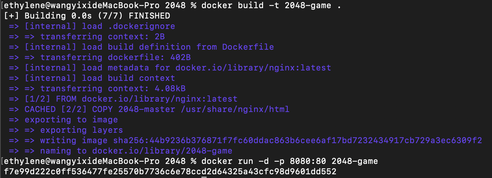
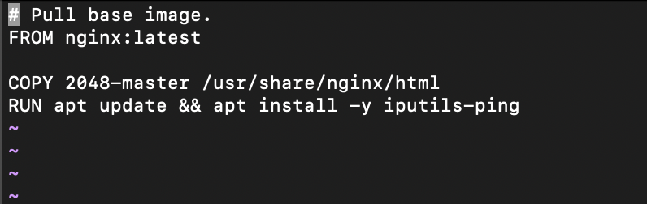
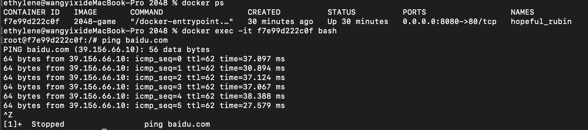

# 第一次作业
## 211250175 王艺羲
1. 使用 2048 源代码构建 2048 镜像
2. 通过 Docker 运行单机版 2048
3. 在 2048 镜像中，使用 RUN 命令安装 iputils-ping （apt update && apt install -y iputils-ping)
4. 使用 docker exec 命令，进入到容器中，执行 ping 命令

### 1. 使用2048源代码构建2048镜像
    
    # 构建2048镜像
    docker build -t 2048-game .
    # 运行2048镜像
    docker run -d -p 8080:80 2048-game

### 2. 通过 Docker 运行单机版 2048

    访问http://localhost:8080

### 3. 在 2048 镜像中，使用 RUN 命令安装 iputils-ping

    # 进入Dockerfile
    vim Dockerfile
    # 添加以下内容
    RUN apt update && apt install -y iputils-ping

### 4. 使用 docker exec 命令，进入到容器中，执行 ping 命令

    # 获取container ID
    docker ps
    # 进入容器 
    docker exec -it f7e99d222c0f bash
    # 执行ping命令
    ping google.com
