# 云原生 第二次作业
## 211250175 王艺羲
### 一.两个微服务启动时都注册到 Eureka 服务
1. 先配置数据库，更改`mysql-pv.yaml`中的hostPath，然后运行客户端
2.使用 `mysql-pv.yaml` 文件中定义的配置来创建一个 Kubernetes 持久卷

部署 MySQL,然后运行客户端

```
kubectl apply -f mysql-pv.yaml
kubectl apply -f mysql-deployment.yaml
kubectl run -it --rm --image=mysql:8.0.33 --restart=Never mysql-client -- mysql -h mysql -pdangerous
```

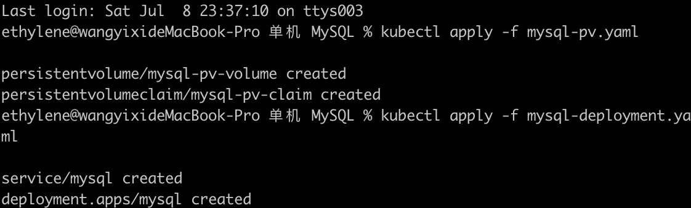

初步创建数据库，验证其功能
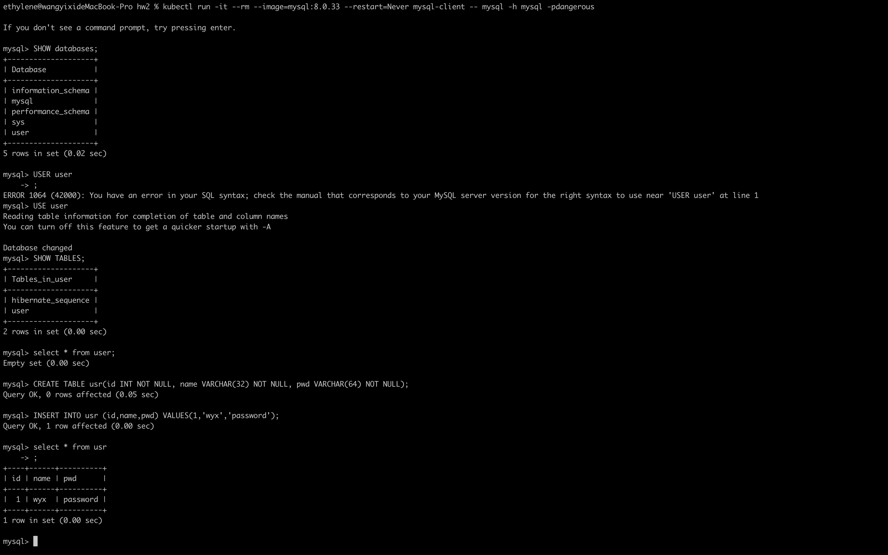
### 二. 构建镜像并配置

构建Eureka镜像并配置
#### 配置admin镜像
```
mvn -B -Dmaven.test.skip clean package
docker build -t admin-service:2023 .
kubectl apply -f admin-deployment.yaml
kubectl apply -f admin-service.yaml
```

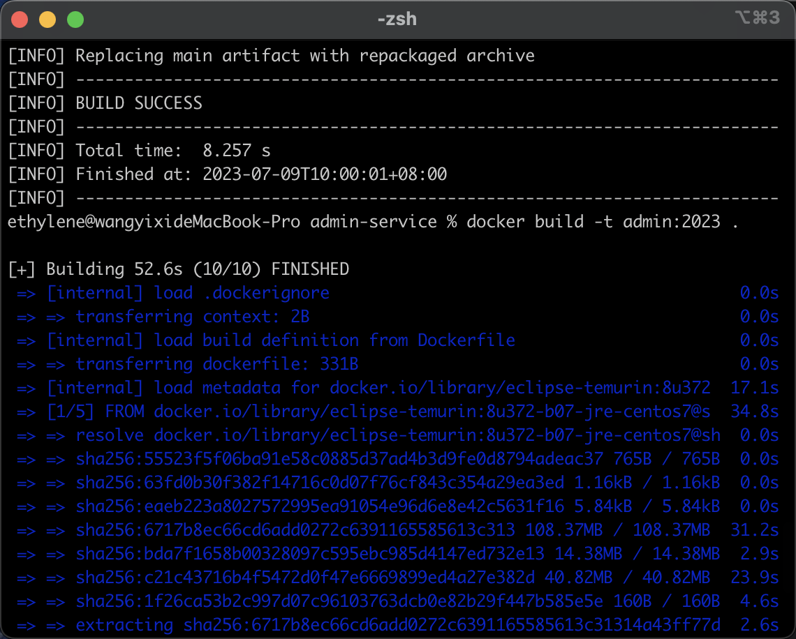
#### 配置user镜像

```
mvn -B -Dmaven.test.skip clean package
docker build -t user-service:2023 .
kubectl apply -f user-deployment.yaml
kubectl apply -f user-service.yaml
```
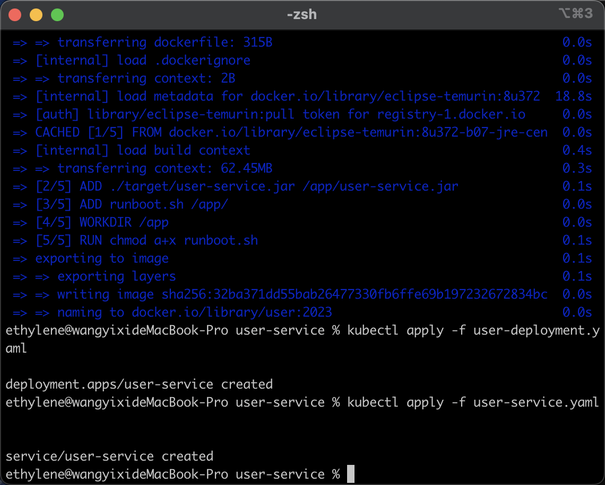

#### 配置eureka镜像

```
mvn -B -Dmaven.test.skip clean package
docker build -t eureka:2023 .
kubectl apply -f eureka-deployment.yaml
kubectl apply -f eureka-service.yaml
```

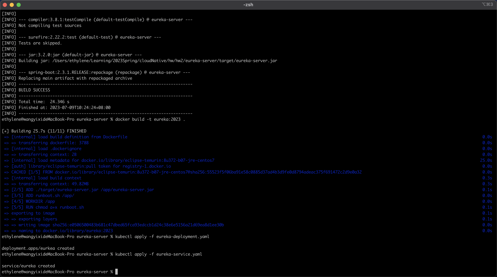
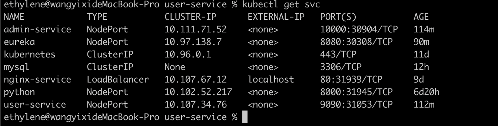

在Eureka-Server上面成功运行
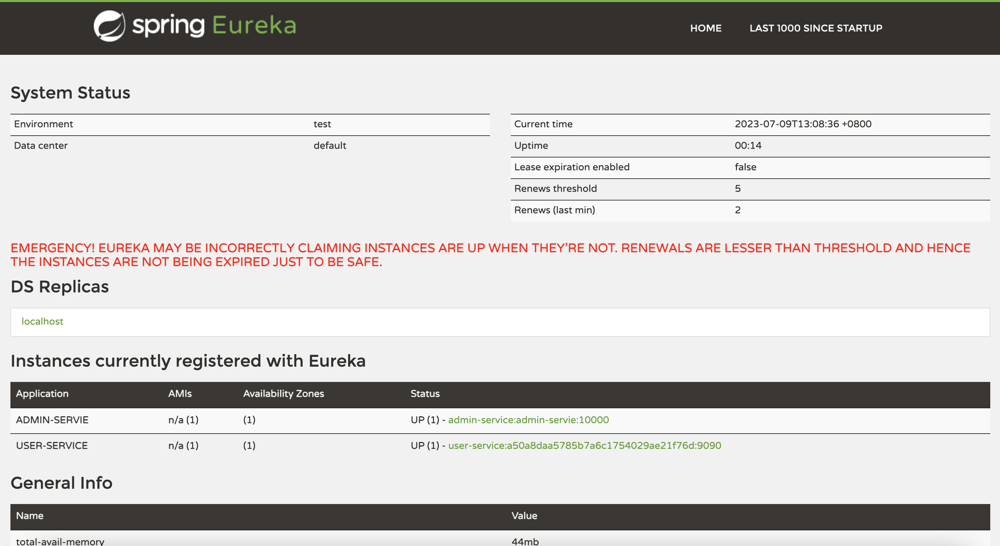
### 三.通过curl指令进行添加用户的尝试

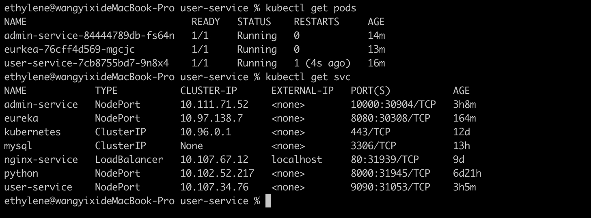
```
curl -H "Content-Type: application/json"  -X POST --data '{"name": "grissom", "pwd": "nju2023"}' http://127.0.0.1:30904/user
```
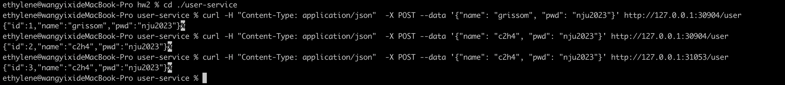
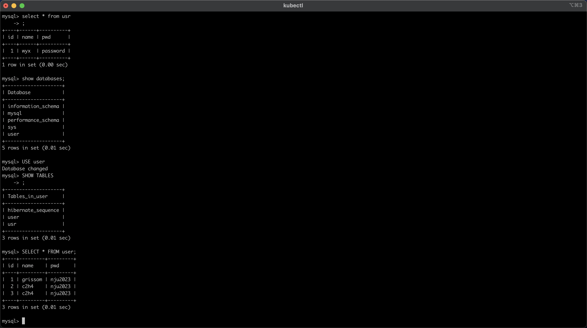
尝试输入空密码或空用户名发现无法插入
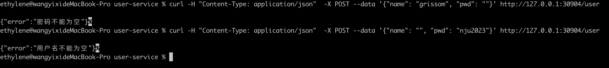

### 四.实现负载均衡
修改user-deployment，Deployment 配置会启动 3 个 Pod 副本，并将它们标记为 `app=user-service`，以便实现负载均衡
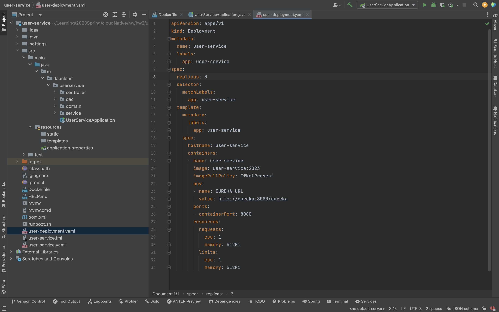

修改src/main/java/io/daocloud/adminservice/config/CustomRule.java中的choose方法

```java
@Override
    public Server choose(Object key) {

        ILoadBalancer loadBalancer = getLoadBalancer();

        // 获取所有可达服务器列表
        List<Server> servers = loadBalancer.getReachableServers();
        if (servers.isEmpty()) {
            return null;
        }

        //用一个随机函数，随机访问实现负载均衡
        int targetServerIndex = new Random().nextInt(servers.size());
        Server targetServer = servers.get(targetServerIndex);

        System.out.printf("choose server %s from %d available servers\n", targetServer.getHost(), servers.size());

        return targetServer;
    }
```
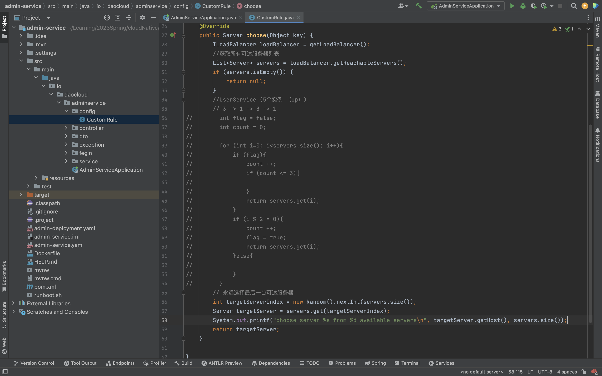
修改后在admin-service的日志中发现每次插入都可能使用不同的userservice