# 云原生大作业说明文档

| 变更人 | 变更时间   | 变更内容                                                     | 版本号 |
| ------ | ---------- | ------------------------------------------------------------ | ------ |
| 王艺羲 | 2023-08-07 |  完成初始文档    | v1.1 |
|孙兆葳|2023-08-08|修改限流内容|v1.2|
|陈鹏霖|2023-08-08|完成限流功能|v1.3|
|陈鹏霖|2023-08-13|完成DevOps要求|v2.1|
|王艺羲|2023-08-14|完成扩容场景|v3.1|
|王艺羲|2023-08-15|整理并完成全部文档|v4.1|


## 1.功能要求

### 1.1 实现一个REST接口

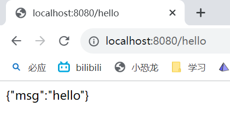

### 1.2 实现限流功能

#### 1.2.1 Ratelimiter

限流功能类Ratelimiter

```java
package com.example.demo.filter;

import org.springframework.stereotype.Component;

import java.time.Duration;
import java.util.concurrent.ConcurrentHashMap;
import java.util.concurrent.atomic.AtomicLong;

@Component
public class RateLimiter {
    private final ConcurrentHashMap<String, AtomicLong> requestCounts = new ConcurrentHashMap<>();
    private final ConcurrentHashMap<String, Long> lastRequestTimes = new ConcurrentHashMap<>();
    private final long timeWindowMillis = 1000;
    private final int requestLimit = 100;

    public boolean allowRequest(String key) {
        long now = System.currentTimeMillis();

        // 初始化计数器和上次请求时间
        requestCounts.putIfAbsent(key, new AtomicLong(0));
        lastRequestTimes.putIfAbsent(key, now);

        AtomicLong requestCount = requestCounts.get(key);
        Long lastRequestTime = lastRequestTimes.get(key);

        // 计算时间窗口内的令牌数
        long tokensToAdd = (now - lastRequestTime) / timeWindowMillis;
        if (tokensToAdd > 0) {
            requestCount.set(Math.min(requestLimit, requestCount.get() + tokensToAdd));
            lastRequestTimes.put(key, now);
        }

        // 尝试获取令牌
        if (requestCount.incrementAndGet() <= requestLimit) {
            return true;
        } else {
            return false;
        }
    }
}
```
以下为代码截图

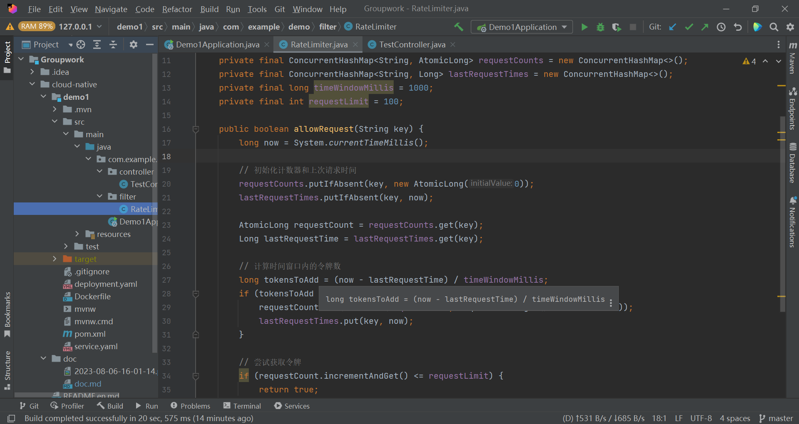

#### 1.2.2 TestController

创建controller类TestController

使用RateLimiter限流功能

```java
package com.example.demo.controller;

import com.example.demo.filter.RateLimiter;
import org.springframework.beans.factory.annotation.Autowired;
import org.springframework.http.HttpStatus;
import org.springframework.http.ResponseEntity;
import org.springframework.web.bind.annotation.GetMapping;
import org.springframework.web.bind.annotation.RestController;

@RestController
public class TestController {

    @Autowired
    private RateLimiter rateLimiter;

    @GetMapping("/hello")
    public ResponseEntity<String> hello() {
        String key = "hello";
        if (rateLimiter.allowRequest(key)) {
            return ResponseEntity.ok("{\"msg\":\"hello\"}");
        } else {
            return ResponseEntity.status(HttpStatus.TOO_MANY_REQUESTS).body("429 Too Many Requests");
        }
    }
}
```
以下为代码截图

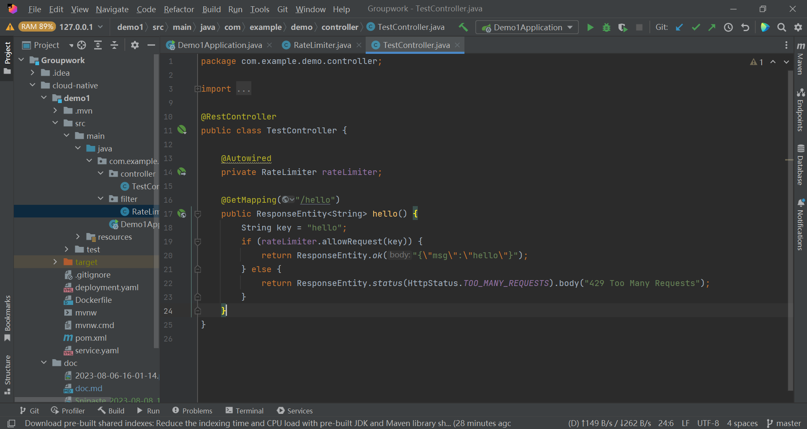

### 1.3 测试限流功能

使用Apache Bench (ab) 工具测试限流

在终端输入 ab -n 1000 -c 100 http://localhost:8080/hello 发送1000个请求，每次并发100个请求

得到如下控制台输出

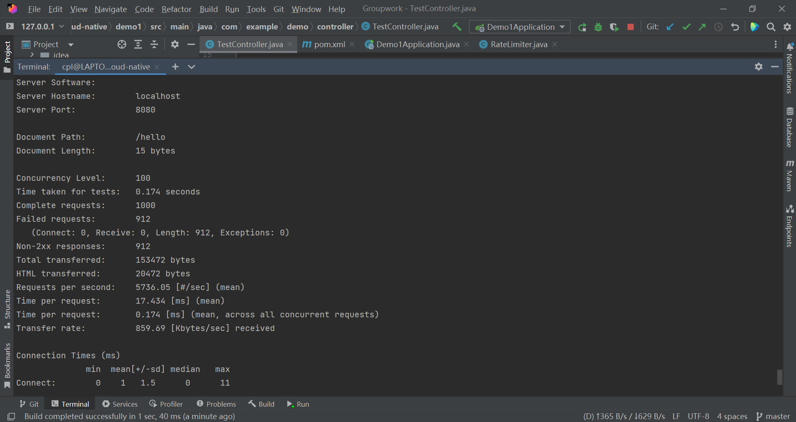

上面的输出中，`Failed requests` 显示有 912 个请求失败，而 `Non-2xx responses` 显示有 912 个请求返回了非2xx的响应，也就是 429 Too Many Requests 响应。

这说明限流功能是成功实现的。


## 2.DevOps要求

### 2.1 Dockerfile 用于构建镜像

```dockerfile
# Dockerfile
FROM openjdk:17

RUN ln -sf /usr/share/zoneinfo/Asia/shanghai /etc/localtime
RUN echo 'Asia/shanghai' >/etc/timezone

WORKDIR /app
ADD target/demo1-0.0.1-SNAPSHOT.jar .

ENTRYPOINT ["java", "-jar", "demo1-0.0.1-SNAPSHOT.jar"]
```
### 2.2 Kubernetes 编排文件

```yaml
# prometheus-test-demo.yaml
apiVersion: apps/v1
kind: Deployment #对象类型
metadata:
  labels:
    app: prometheus-test-demo
  name: prometheus-test-demo
  namespace: nju05
spec:
  replicas: 3 #运行容器的副本数
  selector:
    matchLabels:
      app: prometheus-test-demo
  template:
    metadata:
      annotations:
        prometheus.io/path: /actuator/prometheus
        prometheus.io/port: "8080"
        prometheus.io/scheme: http
        prometheus.io/scrape: "true"
      labels:
        app: prometheus-test-demo
    spec:
      containers: #docker容器的配置
        - image: harbor.edu.cn/nju05/prometheus-test-demo:{VERSION} #pull镜像的地址,本地测试时注销
          #      - image: demo:latest  # win下本地测试用
          name: prometheus-test-demo
      #      imagePullPolicy: Always # 本地测试用
      imagePullSecrets: # 本地测试时注销
        - name: docker-harbor-nju05 # 本地测试时注销
---
apiVersion: v1
kind: Service
metadata:
  name: prometheus-test-demo
  namespace: nju05
  labels:
    app: prometheus-test-demo
spec:
  type: NodePort
  selector:
    app: prometheus-test-demo
  ports:
    - name: tcp
      nodePort: 31999
      protocol: TCP
      port: 8080
      targetPort: 8080

```
### 2.3 持续集成流水线

### 2.4 持续部署流水线

见 JenkinsFile 文件

```groovy
#JenkinsFile.groovy
pipeline {
    agent none
    environment {
        REGISTRY = "harbor.edu.cn/nju05"
    }
    stages {
        // 克隆代码
        stage('Clone Code') {
            agent {
                label 'master'
            }
            steps {
                echo "1.Git Clone Code"
                git url: "https://gitee.com/cpllouis1127/prometheus-test-demo.git"
            }
        }

        // maven 打包
        stage('Maven Build') {
            agent {
                docker {
                    image 'maven:latest'
                    args '-v /root/.m2:/root/.m2'
                }
            }
            steps {
                echo "2.Maven Build Stage"
                sh 'mvn -B clean package -Dmaven.test.skip=true'
            }
        }

        // 构建镜像
        stage('Image Build') {
            agent {
                label 'master'
            }
            steps {
                echo "3.Image Build Stage"
                sh 'docker build -f Dockerfile --build-arg jar_name=target/demo1-0.0.1-SNAPSHOT.jar -t prometheus-test-demo:${BUILD_ID} . '
                sh 'docker tag prometheus-test-demo:${BUILD_ID} ${REGISTRY}/prometheus-test-demo:${BUILD_ID}'
            }
        }

        // 推送镜像
        stage('Push') {
            agent {
                label 'master'
            }
            steps {
                echo "4.Push Docker Image Stage"
                sh "docker login --username=nju05 harbor.edu.cn -p nju052023"
                sh "docker push ${REGISTRY}/prometheus-test-demo:${BUILD_ID}"
            }
        }
    }
}


node('slave') {
    container('jnlp-kubectl') {

        stage('Clone YAML') {
            echo "5. Git Clone YAML To Slave"
            git url: "https://gitee.com/cpllouis1127/prometheus-test-demo.git"
        }

        stage('YAML') {
            echo "6. Change YAML File Stage"
            sh 'sed -i "s#{VERSION}#${BUILD_ID}#g" ./jenkins/scripts/prometheus-test-demo.yaml'
        }

        stage('Deploy') {
            echo "7. Deploy To K8s Stage"
            sh 'kubectl apply -f ./jenkins/scripts/prometheus-test-demo.yaml -n nju05'
        }


    }
}
```

### 2.5 部署流水线

Jenkins 流程

|          |           Stage           |         step         |
| :------: | :-----------------------: | :------------------: |
| 持续集成 |     1.Git Clone Code      | 拉取spring boot代码  |
|          |    2.Maven Build Stage    |    maven构建jar包    |
|          |    3.Image Build Stage    |       构建镜像       |
|          | 4.Push Docker Image Stage | push镜像至docker仓库 |
| 持续部署 | 5.Git Clone YAML To Slave | 拉取部署所需yaml文件 |
|          | 6.Change YAML File Stage  |   改变Yaml环境变量   |
|          |   7.Deploy To K8s Stage   | 部署spring boot应用  |
| 集成测试 |          8.Test           |         测试         |

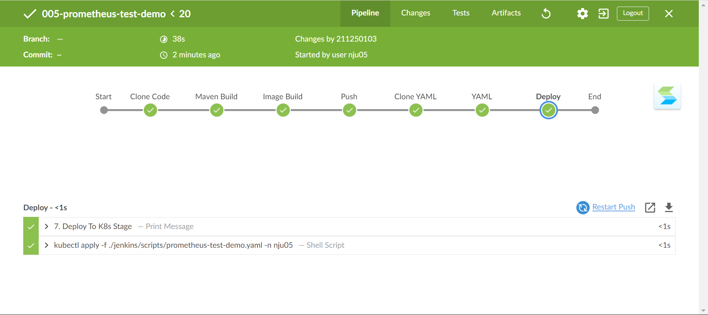


## 3. 扩容场景
### 1. 为该 Java 项目提供 Prometheus metrics 接口，可以供 Prometheus 采集监控指标

提供 Prometheus Metrics 接口
在SpringBoot项目中配置Prometheus Metrics 接口
```yaml
server.port=8080

management.endpoints.web.base-path=/actuator

management.server.port=8080

management.endpoints.web.exposure.include=prometheus

management.prometheus.metrics.export.enabled=true
management.endpoint.health.show-details=always

management.metrics.tags.application=${spring.application.name}
```
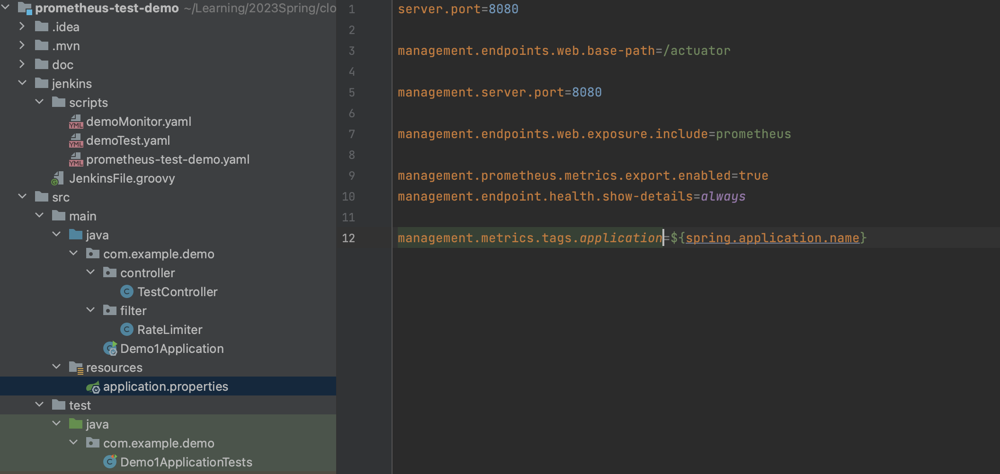
部署k8s - monitor对象
```yaml
apiVersion: monitoring.coreos.com/v1
kind: ServiceMonitor
metadata:
  labels:
    k8s-app: prometheus-test-demo
  name: prometheus-test-demo
  namespace: monitoring
spec:
  endpoints:
    - interval: 30s
      port: tcp
      path: /actuator/prometheus
      scheme: 'http'
  selector:
    matchLabels:
      app: prometheus-test-demo
  namespaceSelector:
    matchNames:
      - nju05
```
放入流水线中部署
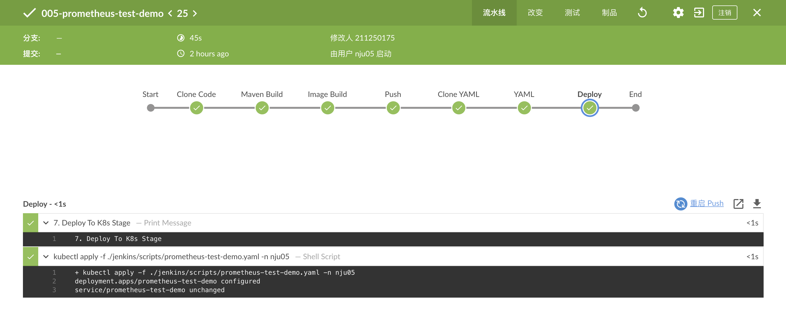
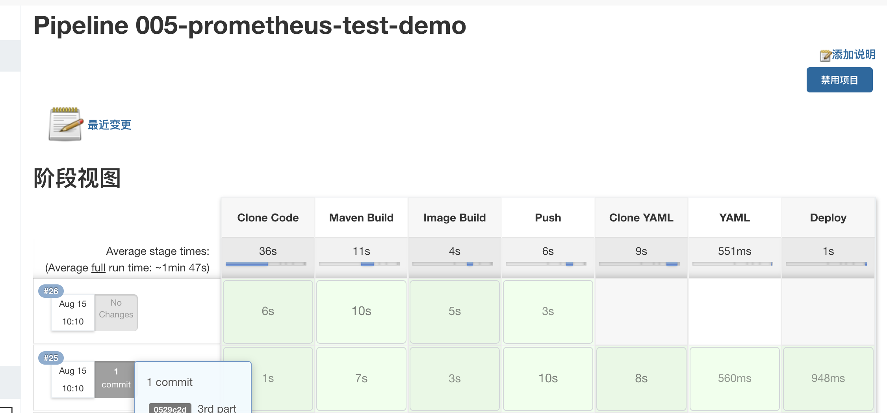
在Prometheus的UI界面验证部署是否成功
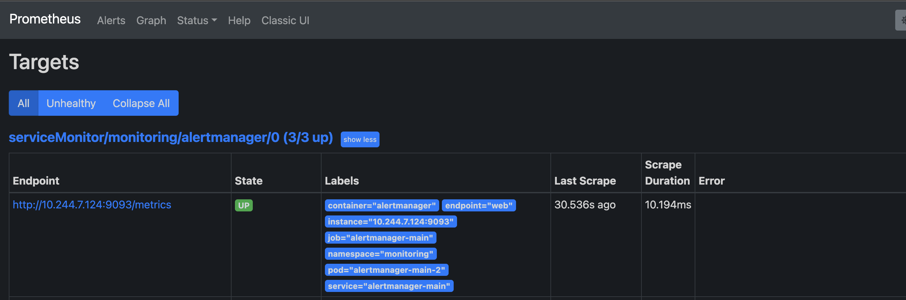
### 2.在 Grafana 中的定制应用的监控大屏（CPU/内存/JVM）

* 在Grafana 中的定制监控应用prometheus-test-demo的各种性能
  * 容器CPU使用情况
  * 容器内存使用情况
  * 网络请求情况
  * 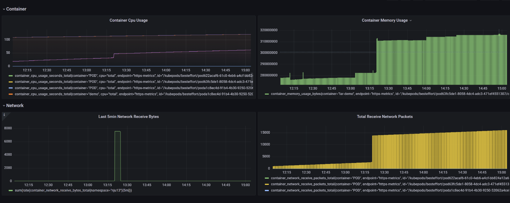
### 3.使用压测工具（例如 Jmeter）对接口进压测，在 Grafana 中观察监控数据
* 使用Jmeter，向172.29.4.18:30332/hello  用100个进程同时发送 100个GET请求
* 配置和结果如下
  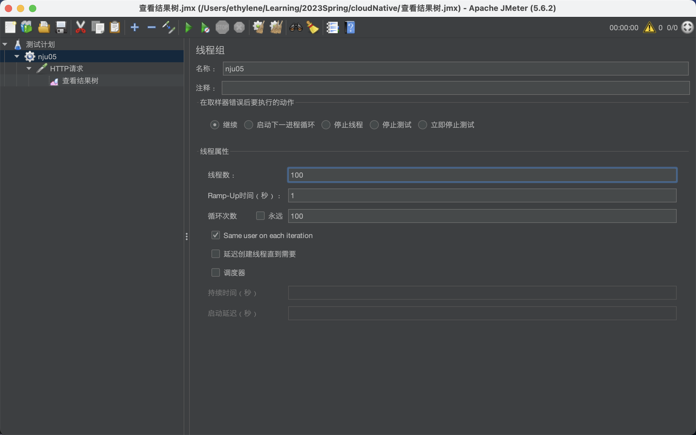
  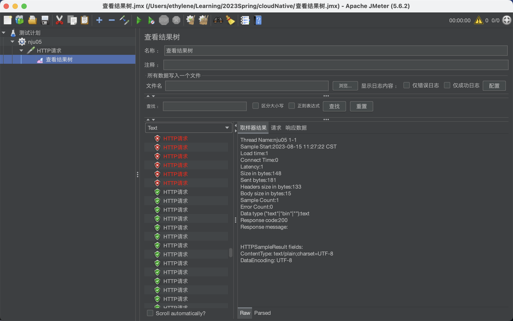
    * 部分请求错误，证明限流成功
* Grafana 监控应用prometheus-test-demo结果如下，明显可看出变化
  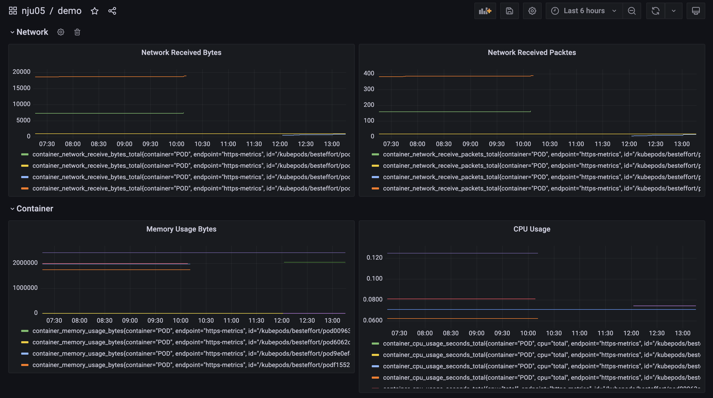
### 4.通过 Kubernetes 命令进行手工扩容，并再次观察 Grafana 中的监控数据
* 命令行扩容发现权限不足，故只能更改yaml文件重新构建流水线
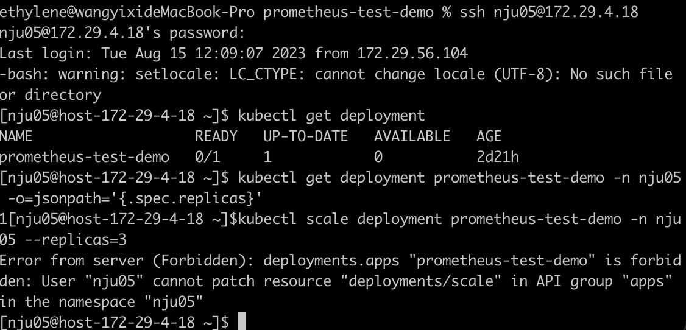

* 扩容后观察Grafana可见，Cpu和Memory的监控面板新增两个Container的曲线
  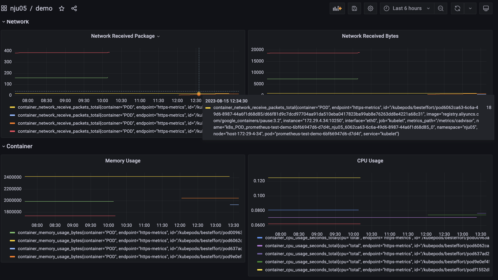

